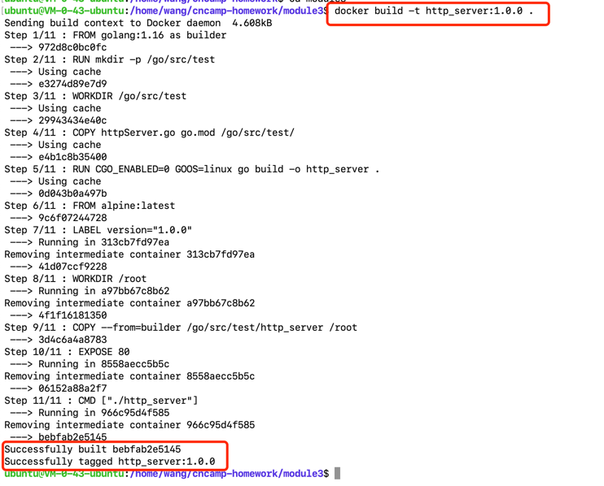
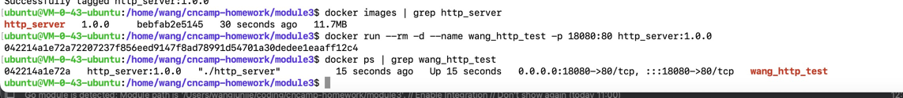
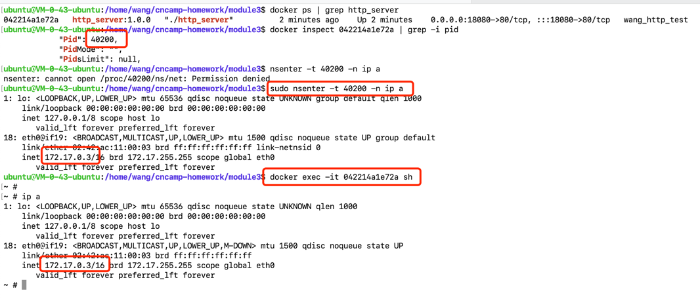

### docker build
```sh
docker build -t http_server:1.0.0 .
```



### docker run
```sh
docker images | grep http_server
docker run --rm -d --name wang_http_test -p 18080:80 http_server:1.0.0
docker ps | grep wang_http_test
```



### Create network ns

```sh
mkdir -p /var/run/netns
find -L /var/run/netns -type l -delete
```

### Check network config for the container

```sh
docker ps | grep http_server
docker inspect 042214a1e72a | grep -i pid
sudo nsenter -t 40200 -n ip a
```

### Check Container Ip config

```sh
docker exec -it 042214a1e72a sh
ip a
```



